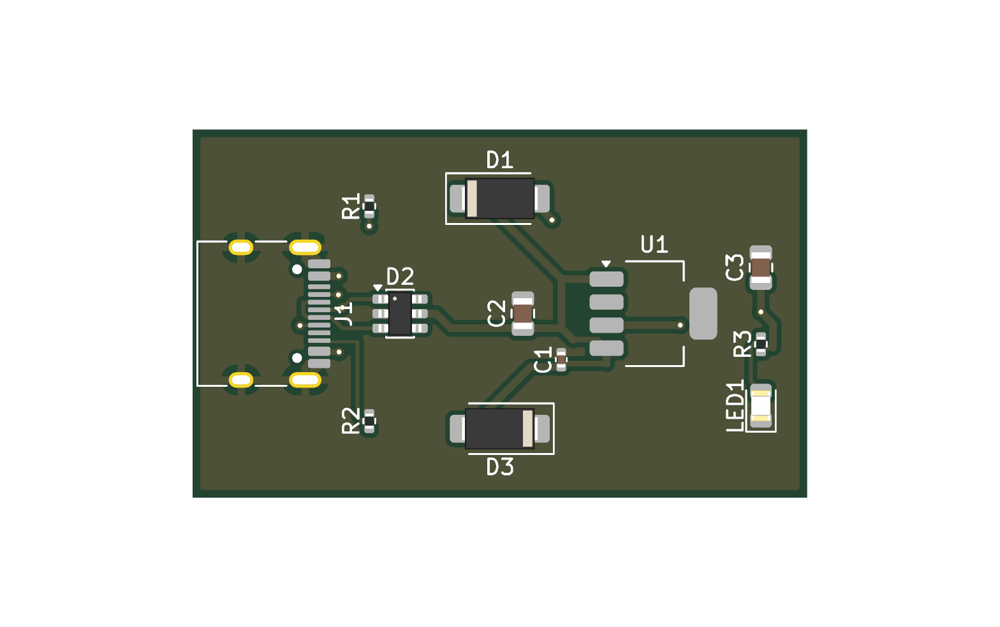
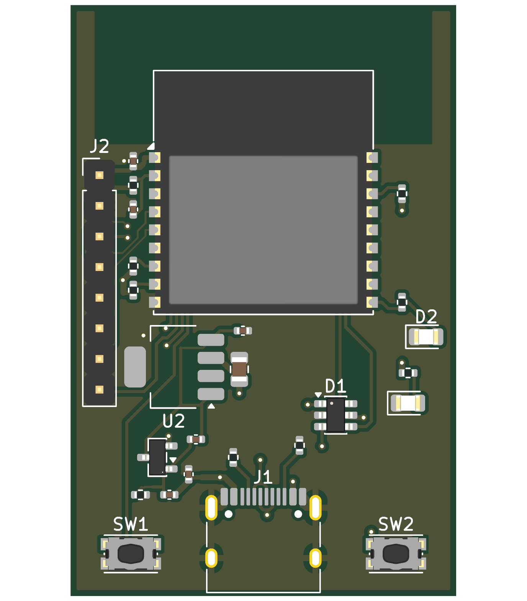
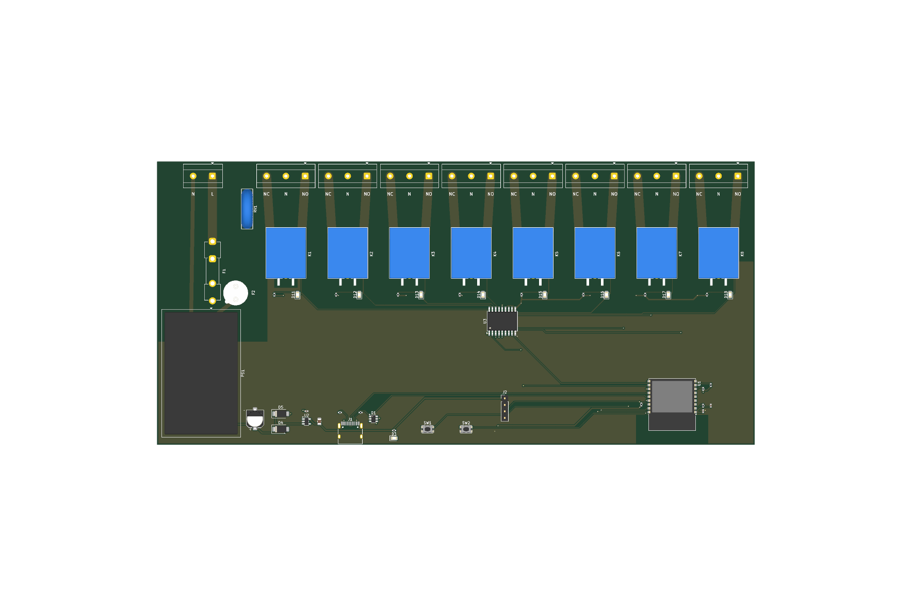

# kicad-scripted-pcb

**[繁體中文](README.zh-TW.md)**

Three KiCad 10 boards designed entirely as code: Python scripts produce the schematic, the PCB
placement, the routing (via [freerouting](https://github.com/freerouting/freerouting)) and the
copper pours, and each board rebuilds from scratch with one command. The KiCad GUI is never opened.

The point is **verification**. Every build runs several independent checks, because each one is
blind to errors the others catch. Some of those errors turned up while these boards were being
built and are listed below.

| | Board | Result |
|---|---|---|
|  | **usbc-ldo**: USB-C 5 V → 3.3 V LDO → LED. 40 × 24 mm, 2 layers. Includes an ngspice power-path simulation. | ERC 0, DRC 0, schematic parity |
|  | **esp32c3**: ESP32-C3 minimal board with native USB, AP2112K LDO, RESET/BOOT, LEDs and an 8-pin header. 32 × 46 mm. | ERC 0, DRC 0, schematic parity, pin-by-pin netlist check |
|  | **relay8**: ESP32-C3 + ULN2803 driving 8 mains relays from **one mains cable**: on-board HLK-10M05 AC-DC (100–240 VAC), T8A fuse, varistor, L/N bus traces, per-channel NO · N · NC terminals, isolation slots and custom mains clearance rules. 232 × 110 mm. **Not safety-certified.** | ERC 0, DRC errors 0 (40 silkscreen-clipped-by-slot/edge warnings listed), schematic parity |

Each ESP32 board has a `FIRMWARE.md` with the pin map, flashing steps, a first program, and, for
relay8, the mains wiring.

## Pipeline

```
gen/board.py ──► .kicad_sch ──► ERC ──► netlist ──► netlist check (vs expected_nets.json)
                                                     │
gen/pcb.py ◄─────────────────────────────────────────┘   place footprints, board outline,
   │                                                     net classes, placement self-check
   ▼
.kicad_pcb ──► Specctra DSN ──► freerouting ──► SES ──► import + GND pour ──► DRC (+ schematic parity)
```

`kicad-cli` has no "update PCB from schematic" command, so `lib/pcbgen.py` builds the board from
the exported netlist with pcbnew.

## What each check catches, and what it missed

| Check | Catches | Missed here (caught by something else) |
|---|---|---|
| `schgen.crossing_pins()` / `overlapping_wires()` | a wire running across a pin (silent short), two nets merged by overlapping wires | — |
| KiCad ERC | unconnected pins, undriven power | **LED wired backwards** (two passive pins, ERC is fine with it). Found by reading the netlist while building the PCB. |
| `check_netlist.py` vs `expected_nets.json` | wrong pin→net, single-pin nets | ERC ignores "global label appears only once" **by default**, so a label typo creates an isolated net with no ERC error. Proven with a deliberate typo (mutation test). |
| placement self-check | pad nets vs netlist, footprints off-board, courtyard overlap | Uses real courtyard polygons. The ESP32 module's courtyard is T-shaped, and bounding boxes reject legal positions. |
| DRC + `--schematic-parity` | clearance, track width, edge clearance, schematic vs PCB | — |
| custom DRC rules (`relay8.kicad_dru`) | mains ↔ low voltage ≥ 3.0 mm, mains ↔ mains ≥ 2.4 mm | Creepage around the slots is not checked by DRC. Needs a human. |
| ngspice simulation (`usbc-ldo/sim`) | design margins | The first board's 1.1 V-dropout LDO falls out of regulation at USB's 4.40 V minimum, and its input capacitance injects ~124 µC on hot-plug (USB 2.0 limit: 50 µC). The ESP32 boards were designed from these results. |

## Things that cost time (so they don't cost yours)

- **freerouting-cli 2.5.0 crashes** on KiCad 10 DSN files ([freerouting#957](https://github.com/freerouting/freerouting/issues/957)). Use the jar, which needs Java 25.
- freerouting's **automatic neck-down** narrows tracks to 0.125 mm beside 0402 pads, below JLCPCB's 0.127 mm minimum. Use `--router.automatic_neckdown=false --router.neck_width_um=150`.
- The DSN carries no copper-to-edge rule. Pass `--router.copper_to_edge_clearance_um`. That setting **does not cover internal slots**, so put keepouts around slots.
- Net classes live in `.kicad_pro`, not `.kicad_pcb`. Save with `pcbnew.SaveBoard()`, which writes both.
- `board.Remove(zone)` from Python can raise `'SwigPyObject' has no attribute 'thisown'` or crash pcbnew (0xC0000005). Use `board.Delete()`.
- freerouting reports pin-to-pin "violations" inside fine-pitch footprints where KiCad's DRC is clean. The cause is KiCad's DSN exporter inflating **every** edge of a rounded-rect pad (`specctra_export.cpp`) by the arc-approximation margin.
- Windows PowerShell 5.1 reads BOM-less UTF-8 scripts as ANSI. The build scripts here are ASCII-only for that reason.

## Requirements

- Windows (the build scripts are PowerShell; the Python parts are cross-platform)
- [KiCad 10](https://www.kicad.org/) (uses its bundled Python for pcbnew, and its ngspice). Set `KICAD_BIN` / `KICAD_SHARE` if it is not in the default location.
- Python 3.10+ on PATH for schematic generation (standard library only). The simulation needs `numpy` and `matplotlib`.
- freerouting 2.5.0 jar + a Java 25 runtime. Run `tools\setup-tools.ps1` once; it downloads both into `tools\` with pinned SHA-256 checks.

## Quick start

```powershell
powershell -ExecutionPolicy Bypass -File tools\setup-tools.ps1
powershell -ExecutionPolicy Bypass -File boards\esp32c3\build.ps1
```

## Layout

```
lib/        shared: schematic writer, net-label helper, PCB builder, routing, netlist check
boards/<b>/gen/board.py   the circuit (pin -> net table)
boards/<b>/gen/pcb.py     placement (BoardSpec)
boards/<b>/build.ps1      one-command build
tools/      setup-tools.ps1 (downloads are git-ignored)
```

Code comments are in Chinese. The boards were built while comparing AI-assisted workflows in
KiCad and EasyEDA Pro.

## Limits

These are two-layer boards with modules and simple power. There is no controlled impedance, no
length matching, no BGA and no SI/PI analysis; freerouting does none of these. Treat the outputs as
a starting point that a person reviews, not as fab-ready designs. This applies above all to
**relay8**, which switches mains voltage.

## License

MIT. freerouting (GPL-3.0) and the Temurin JRE (GPL-2.0 with Classpath Exception) are downloaded at
setup time and are not part of this repository.
