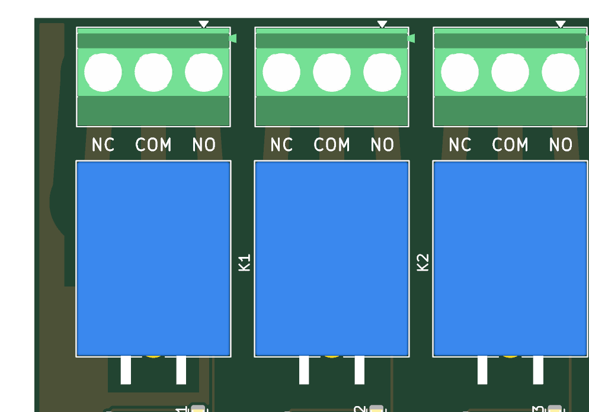

# 8-channel relay board — firmware handoff and wiring

> **This board switches mains (110/230 VAC).** Wiring mains can kill. A clean DRC is not a
> safety review. Have the board and the wiring checked by someone qualified, mount it in a closed
> enclosure, and disconnect mains before touching anything.

## Pin map

| Relay | GPIO | Indicator LED |
|---|---|---|
| K1 | IO0 | D11 |
| K2 | IO1 | D12 |
| K3 | IO3 | D13 |
| K4 | IO4 | D14 |
| K5 | IO5 | D15 |
| K6 | IO6 | D16 |
| K7 | IO7 | D17 |
| K8 | IO10 | D18 |

GPIO **high** → ULN2803 channel on → relay energised (COM–NO closed) → red LED on.
The ULN2803 inputs have internal pull-downs, so every relay is off while the ESP32 resets or boots.

Other pins are as on the ESP32-C3 minimal board (see `../esp32c3/FIRMWARE.md`): USB on IO18/IO19,
UART on IO20/IO21 (also header J2: 1 3V3 · 2 GND · 3 TXD · 4 RXD), BOOT on IO9, RESET on EN,
pull-ups on IO2/IO8/IO9. There is no free GPIO left and no user LED.

## Power

| Input | Feeds | Notes |
|---|---|---|
| **J3 DC jack, 5 V ≥ 2 A**, centre positive | relay coils + logic | Needed for the relays to switch |
| USB-C | logic only | Flashing and testing; relays cannot switch on USB alone |

Both inputs are diode-OR'ed (SS34) into the 3.3 V regulator, so USB and the DC jack can be
connected at the same time without back-feeding the computer.
All 8 relays on draw about 0.6 A from the DC jack.

## Example (Arduino, board "ESP32C3 Dev Module", USB CDC On Boot enabled)

```cpp
const int RELAY[8] = {0, 1, 3, 4, 5, 6, 7, 10};  // K1..K8

void setup() {
  for (int pin : RELAY) {
    digitalWrite(pin, LOW);   // set the level before enabling the output: no glitch
    pinMode(pin, OUTPUT);
  }
  Serial.begin(115200);
}

void loop() {
  for (int i = 0; i < 8; i++) {
    digitalWrite(RELAY[i], HIGH);
    Serial.printf("K%d on\n", i + 1);
    delay(500);
    digitalWrite(RELAY[i], LOW);
  }
}
```

Relays are slow and wear out: do not switch them faster than about once per second in a loop,
and expect roughly 100,000 operations at rated load.

## Mains wiring: the board is only a switch

Mains does **not** power the board and does not enter it anywhere else. Each channel is an
independent switch on its own green 3-pin terminal (J11–J18, along the top edge, one above each
relay K1–K8). The silkscreen under each terminal reads **NC · COM · NO** from left to right
(component side up, terminals at the top). The labels are generated from the nets the pads are
actually on, so they cannot disagree with the circuit:



To switch an appliance: cut **only its live wire**, connect the supply end to **COM** and the
appliance end to **NO**. Leave neutral and earth uncut.

- **COM**: common contact
- **NO**: normally open. Connected to COM only while the relay is on.
- **NC**: normally closed. Connected to COM while the relay is off.

Switch the **live (L)** conductor; neutral and earth go straight to the load:

```
 mains L ──[ fuse ]────────── COM ┐
                                  │ relay contact (inside the board)
              load L ──────── NO  ┘
 mains N ──────────────────────────────────── load N
 mains PE (earth) ─────────────────────────── load PE
```

- Load on when the relay is on: use **NO**. Load on when the relay is off (fail-on): use **NC**.
- Rating: **5 A per channel** at 250 VAC, set by the 2.5 mm board traces. The relay alone is rated
  10 A. Put a fuse of 5 A or less in the live feed of each channel or upstream.
- Do not switch motors, compressors or transformers near the limit. Inrush current welds relay contacts.
- Use wire rated for mains (≥ 0.75 mm²) and tighten the terminal screws.

## Must be checked on real hardware before mains is connected

1. **NO/NC pin assignment.** Relay pins 3 = NO and 4 = NC were taken from the KiCad symbol graphic,
   because the manufacturer's pin drawing could not be read. With a multimeter and the relay
   unpowered, COM must show continuity to **NC**. Energise it (DC jack + firmware): COM must switch to **NO**.
2. **Terminal block orientation.** The wire entries must face the board edge (check in KiCad's 3D view).
3. **Creepage and clearance.** Mains-to-low-voltage spacing is ≥ 3.0 mm through air, and the slots
   beside each COM trace are meant to make the surface path ≥ 5 mm. Have this verified.
