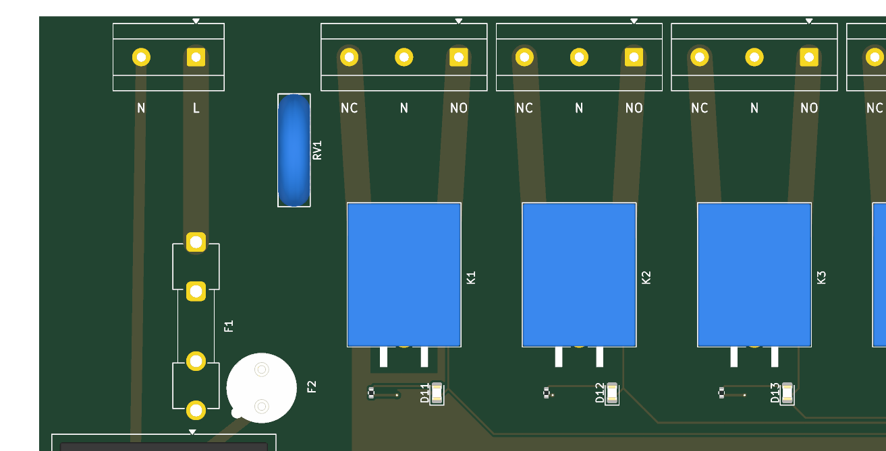

# 8-channel relay board — firmware handoff and wiring

> **Mains (100–240 VAC) enters this board.** It runs through the input terminal, fuses, varistor,
> the on-board AC-DC module, two bus traces and all 8 relays. Wiring mains can kill, and a clean DRC
> is not a safety review. Have the board and the wiring checked by someone qualified, mount it in
> a closed enclosure, and disconnect mains before touching anything.

## Pin map

| Relay | GPIO | Indicator LED |
|---|---|---|
| K1 | IO0 | D11 |
| K2 | IO1 | D12 |
| K3 | IO3 | D13 |
| K4 | IO4 | D14 |
| K5 | IO5 | D15 |
| K6 | IO6 | D16 |
| K7 | IO7 | D17 |
| K8 | IO10 | D18 |

GPIO **high** → ULN2803 channel on → relay energised (live switched to NO) → red LED on.
The ULN2803 inputs have internal pull-downs, so every relay is off while the ESP32 resets or boots.

Other pins are as on the ESP32-C3 minimal board (see `../esp32c3/FIRMWARE.md`): USB on IO18/IO19,
UART on IO20/IO21 (also header J2: 1 3V3 · 2 GND · 3 TXD · 4 RXD), BOOT on IO9, RESET on EN,
pull-ups on IO2/IO8/IO9. There is no free GPIO left and no user LED.

## Power

One mains cable powers everything.

| Input | Feeds | Notes |
|---|---|---|
| **J20 MAINS IN (L, N)**, 100–240 VAC | the 8 relay contacts **and**, through the on-board HLK-10M05 (5 V 2 A), the relay coils and the logic | Normal operation |
| USB-C | logic only | Flashing and testing; with mains unplugged the relays cannot switch |

The HLK 5 V output and USB VBUS are diode-OR'ed (SS34) into the 3.3 V regulator, so USB can stay
connected while mains is on without back-feeding the computer.

**Known USB limit (not fixed yet):** there is no soft-start on VBUS. Behind the LDO sit C2 10 µF and
the module's own ~12.3 µF, so hot-plugging USB draws more than the USB 2.0 inrush allowance
(10 µF / 50 µC). Laptops and hubs normally tolerate this, but it is out of spec. The fix is the
AO3401A soft-start used on `../esp32c3` (`lib/review.py` rule `vbus-cap` flags it; waived in
`review-waivers.json` until then).

Protection: **F1 T8A** (5×20 mm) in the live feed, then a 14D431K varistor across L–N, then
**F2 T1A** (TR5) in front of the AC-DC module.

## Example (Arduino, board "ESP32C3 Dev Module", USB CDC On Boot enabled)

```cpp
const int RELAY[8] = {0, 1, 3, 4, 5, 6, 7, 10};  // K1..K8

void setup() {
  for (int pin : RELAY) {
    digitalWrite(pin, LOW);   // set the level before enabling the output: no glitch
    pinMode(pin, OUTPUT);
  }
  Serial.begin(115200);
}

void loop() {
  for (int i = 0; i < 8; i++) {
    digitalWrite(RELAY[i], HIGH);
    Serial.printf("K%d on\n", i + 1);
    delay(500);
    digitalWrite(RELAY[i], LOW);
  }
}
```

Relays are slow and wear out: do not switch them faster than about once per second in a loop,
and expect roughly 100,000 operations at rated load.

## Mains wiring

All terminals sit along the top edge; the silkscreen under each pin says what it is (generated from
the net each pad is on, so it cannot disagree with the circuit):

- **J20 (far left), `N · L`**: the supply cable. Live to **L**, neutral to **N**.
- **J11–J18, one above each relay K1–K8, `NC · N · NO`**: one appliance per channel.



```
 supply L ──► J20 L ──[F1 T8A]── L bus ──► COM of every relay
 supply N ──► J20 N ──────────── N bus ──► the middle pin (N) of every output terminal

 appliance:  live    ──► NO   (on while the relay is on)    or NC (on while the relay is off)
             neutral ──► N    (same terminal)
             earth   ──► NOT on this board: connect it straight to the supply earth
```

- You do **not** have to use all 8 channels. Unused terminals stay empty.
- Ratings: **5 A per channel** (2.5–3.5 mm traces on 1 oz copper) and **8 A in total** (bus
  traces, F1). The relays alone are rated 10 A; the board is the limit.
- Do not switch motors, compressors or transformers near the limit. Inrush current welds relay contacts.
- Use wire rated for mains (≥ 0.75 mm²) and tighten the terminal screws.

## Must be checked on real hardware before mains is connected

1. **NO/NC pin assignment.** Relay pins 3 = NO and 4 = NC were taken from the KiCad symbol graphic,
   because the manufacturer's pin drawing could not be read. With the board unpowered, measure
   continuity from J20 **L** (after F1) to each channel: it must reach **NC**, not NO. With mains
   connected and the relay energised, the live moves to **NO**. Measure with care, or with an
   isolated low-voltage source on J20 instead of mains.
2. **Terminal block orientation.** The wire entries must face the board edge. KiCad has no 3D model
   for the MetzConnect Type171 blocks here, and the footprint outline is nearly symmetric, so this
   cannot be confirmed from the files. Check it against the part's datasheet before ordering.
3. **Creepage and clearance.** Mains-to-low-voltage spacing is ≥ 3.0 mm through air (DRC rule), and
   the slots beside each COM trace are meant to make the surface path ≥ 5 mm. Check the PCB under the
   AC-DC module too. Have all of this verified.
4. **Earth.** There is no earth on the board. Appliances that need earth must get it directly from
   the supply.
